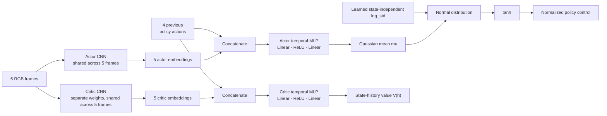

# Observations and Models

## Policy Observation

The gym-duckietown PPO policy receives a fixed temporal history by default:
five camera observations including the current frame and the four normalized
policy actions executed between them. It has no recurrent state, optical flow,
map input, or lane telemetry.

At an episode start, the first observation is repeated five times and all four
past actions are zero. Histories are reset at every episode boundary. The
lengths are configured with `--observation-history-length` and
`--action-history-length`; the latter must be exactly one smaller.

gym-duckietown normally returns a `uint8` RGB array with shape:

```text
(height, width, 3) = (480, 640, 3)
```

Duckiematrix observations are treated as BGR by the current collection and
live-evaluation scripts. Saved imitation images are converted to RGB.

The channel order is explicit in the gym-duckietown trainer through
`--source-observation-channel-order`. Its default is `rgb`.

## RL Preprocessing

For each frame in the gym-duckietown observation history:

1. Validate an `(H, W, 3)` array and convert to `uint8` if necessary.
2. Convert BGR to RGB only when configured.
3. Crop all rows above `crop_y_start`.
4. Resize the remaining image to `image_size x image_size` with bilinear
   interpolation.
5. Convert pixels to a PyTorch tensor in `[0, 1]`.
6. Normalize with ImageNet statistics.

The defaults are:

```text
crop_y_start = 0
image_size = 224
mean = (0.485, 0.456, 0.406)
std  = (0.229, 0.224, 0.225)
```

There is no JPEG round trip in the PPO image pipeline.

## Imitation Preprocessing

The imitation trainer loads RGB images through Pillow, resizes them to the
configured square image size, converts them to tensors, and applies the same
ImageNet normalization.

The trainer looks for `images_processed` by default. Passing
`--image-dir images` selects the original collected JPEGs and avoids the
legacy offline preprocessing step.

The preprocessing used to train an IL checkpoint must match live evaluation
and any PPO warm start. A model can be mathematically correct and visually
confused at the same time.

## Encoders

Supported encoders are:

- `mobilenet_v3_small`
- `resnet18`

For PPO, actor and value network use separate CNN encoders. They do not share
weights with each other. Within either network, every history frame is encoded
independently by the same weight-shared CNN.

A fresh PPO actor and value network use ImageNet initialization for both CNN
encoders. An IL warm start always replaces the actor encoder with the matching
IL encoder. In `residual` mode it also transfers the current-frame action head;
in the default `temporal_mlp` mode the direct temporal head starts with standard
random initialization. A resumed PPO run restores both complete networks.

## Actor

The PPO actor contains:

- one CNN encoder shared across all history frames
- a temporal MLP over all frame embeddings and past actions
- a learned state-independent `log_std` vector

For history input (h_t):

```text
h_t  = [CNN(o_(t-4)), ..., CNN(o_t), a_(t-4), ..., a_(t-1)]
mu_t = temporal_MLP(h_t)
z_t  ~ Normal(mu_t, exp(log_std))
u_t  = tanh(z_t)
```

This direct `temporal_mlp` architecture is the default and its linear layers
use standard PyTorch random initialization. It learns the complete policy mean,
not merely a correction to a current-frame policy.

`--temporal-head-mode residual` retains the optional previous architecture:

```text
mu_t = current_frame_head(CNN(o_t)) + temporal_residual_MLP(h_t)
```

Only the residual output layer starts at zero, so this mode initially
reproduces a current-frame or IL-warm-started policy.

The `tanh` output `u_t` is a policy control, not necessarily the final wheel
command. The selected action mode maps it to the environment action.

## Value Network

The value network predicts one scalar `V(h_t)` from the same observation and
action history. By default its own temporal MLP predicts the value directly.
The optional `residual` mode mirrors the actor's
current-frame-plus-correction architecture.

## Compact Network Diagram



For MobileNetV3-Small, each frame embedding has 1024 values; for ResNet-18
it has 512. With five frames and four two-dimensional past actions, the
MobileNet temporal MLP input therefore has:

```text
5 * 1024 + 4 * 2 = 5128 values
```

Actor and critic CNN parameters are optimized independently during PPO.

## Deterministic Network Behavior During PPO

MobileNet contains BatchNorm and Dropout modules. PPO log-probability ratios
require the same observation and parameters to produce the same distribution
before an update.

The implementation therefore:

- sets all Dropout probabilities in the PPO encoder to zero
- keeps actor and value modules in evaluation mode during PPO
- freezes BatchNorm running statistics
- still computes gradients through convolutional, normalization-affine, and
  linear parameters

Evaluation mode here controls module behavior; it does not disable gradients.
